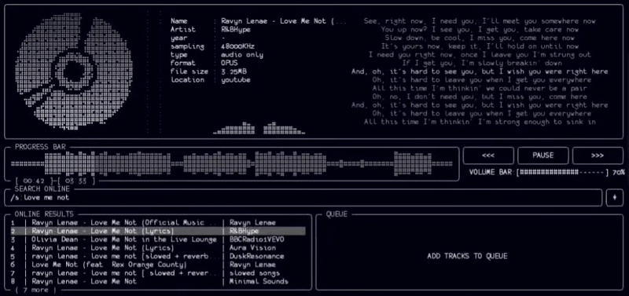

<div align="center">Mousiki 🎵

<p align="center">
  <a href="https://opensource.org/" target="_blank">
    
  </a>
  &nbsp;
  <a href="https://www.apache.org/" target="_blank">
    
  </a>
</p>


> [!NOTE]
> **Developer note:** Mousiki is released under the Apache License 2.0.
> You are free to use, modify, fork, re-distribute, and sell the software,
> subject to the terms of the license.


Mousiki is a terminal music player built from the ground up for people who prefer control, simplicity, and a keyboard. It's a
fast, focused TUI (Terminal User Interface) without unnecessary interface layers — fully keyboard-driven and configurable, wit
h spectrum visualizers, synced lyrics, and online streaming, all without leaving your terminal.

``Personal preference is not a compromise—it's the design goal.``

[FOR WIN32 CLICK HERE](https://github.com/StSchwerdtfeger/Mousiki-Windows-Native-Port)

## Preview



</div>

## ✨ Features

- **Local Music Playback:** Instantly browse and play your local music files.
- **Online Search & Streaming:** Search and stream tracks directly from online sources.
- **Synced Lyrics:** Real-time, word-by-word active lyrics highlighting as the song plays.
- **Visualizers:** Real-time FFT spectrum, waveform rendering, and spinning disk art.
- **Queue Management:** Effortless queueing, shuffling, and repeating.
- **Highly Configurable:** Tweak colors, visualizer fluidity, animations, and hotkeys to match your exact workflow.

## 🚀 Supported Platforms

- **Native Support:** **Linux**, **macOS**, and **Android (Termux)**.
- **Unverified Support:** *Windows WSL*. (Support for Windows is currently not verified because I don't have the hardware access needed to test and debug on that operating system. If you try it out and get it working, feel free to contribute!)

## 🛠️ Getting Started
<div align="center">
  
## Default Keybindings

Configurable in `$HOME/.config/mousiki/config.txt`.

### Search & Playback
| Action | Keybinding | Description |
| :--- | :--- | :--- |
| **Local Search** | `/` | Filter and search local library |
| **Online Stream Search** | `/s: <query>` | Search and stream music online |
| **Download Stream** | `y` | Download currently streaming track |
| **Play / Pause** | `p` (or `ENTER`) | Toggle playback |
| **Next / Previous Track** | `n` / `b` | Skip between songs |
| **Seek** | `ARROW_LEFT` / `ARROW_RIGHT` | Seek backward / forward |
| **Volume** | `1` / `2` | Decrease / Increase volume |
| **Shuffle / Repeat** | `m` / `r` | Toggle shuffle or repeat mode |

### Navigation & Queue
| Action | Keybinding | Description |
| :--- | :--- | :--- |
| **Navigate** | `ARROW_UP` / `ARROW_DOWN` | Move selection |
| **Switch Tabs/Cards** | `TAB` | Cycle between UI panels |
| **Add to Queue** | `a` | Enqueue selected track |
| **Remove from Queue** | `d` | Dequeue selected track |
| **Filter by Folder** | `f` | Apply folder filter |
| **Clear Filter** | `c` | Reset active search/filters |
| **Quit** | `q` | Exit application |

</div>

### Prerequisites & Installation

Mousiki relies on a few external tools for audio fetching, decoding, and lyrics. The easiest way to get started is by running the setup script on macOS (requires [Homebrew](https://brew.sh)), Debian-based Linux, or Termux:

```bash
# Clone the repository
git clone https://github.com/itzender5820/mousiki.git
cd mousiki

# Run the setup script (installs dependencies, sets up config, and builds the app)
bash setup.sh
```

If you're building manually, ensure you have `cmake`, a C++17 compiler, `ffmpeg`, `yt-dlp` (or let `setup.sh` fetch its standalone binary for you), and `libcurl` development headers (e.g. `libcurl4-openssl-dev` on Debian/Ubuntu) installed.

### Running the App

After a successful build, you can start the player with:
```bash
./build/mousiki
```

## ⚙️ Configuration

Your configuration file will be automatically generated at `$HOME/.config/mousiki/config.txt`. From there, you have complete freedom to customize Mousiki.

### Adding Custom Music Paths
You can easily tell Mousiki where to look for your music. Simply add multiple `LocalMusicPath` entries in your `config.txt`:

```ini
# Add as many custom paths as you need:
LocalMusicPath=/custom/path
LocalMusicPath=/home/user/Music
```

## 🙏 Attribution & Dependencies

Mousiki stands on the shoulders of giants. A huge thank you to the developers behind these awesome open-source projects that make Mousiki tick:

- **[miniaudio](https://github.com/mackron/miniaudio):** An incredible single-file audio playback and capture library.
- **[kissfft](https://github.com/mborgerding/kissfft):** A wonderfully simple and lightweight real-input FFT library (powering the spectrum visualizer).
- **[yt-dlp](https://github.com/yt-dlp/yt-dlp):** The backend magic for our online search and streaming capabilities.
- **libcurl:** used directly (no Python) to fetch synced lyrics from Better Lyrics (primary) and [LRCLIB](https://lrclib.net) (fallback). yt-dlp handles all YouTube search/streaming; setup.sh installs its standalone binary, so no Python is needed for that either.
- **[FFmpeg](https://ffmpeg.org/):** The Swiss army knife of multimedia handling.

<div align="center">

## 📜 License

This project is open-sourced under the [Apache License 2.0](LICENSE). 

## Star History

<a href="https://www.star-history.com/?repos=itzender5820%2Fmousiki&type=date&legend=top-left">
  <picture>
    <source media="(prefers-color-scheme: dark)" srcset="https://api.star-history.com/chart?repos=itzender5820/mousiki&type=date&theme=dark&legend=top-left" />
    <source media="(prefers-color-scheme: light)" srcset="https://api.star-history.com/chart?repos=itzender5820/mousiki&type=date&legend=top-left" />
    
  </picture>
</a>

---
*Crafted with ❤️ for the terminal by [itzender5820](https://github.com/itzender5820)*


<p align="center">
  
</p>

</div>
